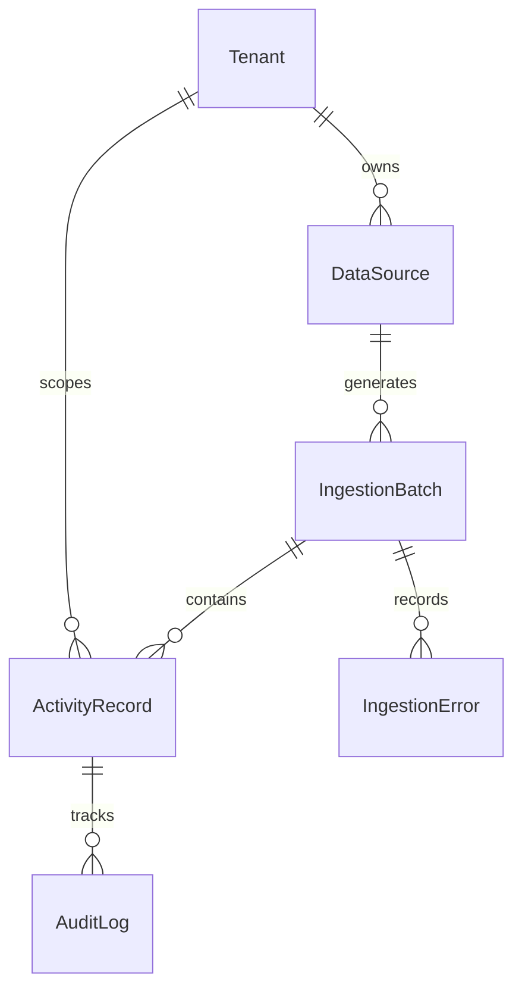

# Data Model Design & Schema Documentation (MODEL.md)

This document explains the schema design, field choices, auditing, security, and multi-tenancy implementation in **Breathe ESG Ingestor**.

---

## 1. Schema Diagram & Relationships

The database is built on top of six core models:

---

## 2. Models Specification

### 1. Tenant
- **Fields**: `id` (UUID), `name` (CharField), `slug` (SlugField, unique), `created_at` (DateTimeField)
- **Rationale**: Isolates all activity records and data sources per client. UUID primary keys prevent sequential ID enumeration attacks, securing tenant boundaries.

### 2. DataSource
- **Fields**: `id` (UUID), `tenant` (FK to Tenant), `source_type` (Choices: SAP, UTILITY, TRAVEL), `label` (CharField), `created_at` (DateTimeField), `config` (JSONField)
- **Rationale**: Represents the incoming interface. The `config` JSONField stores source-specific settings (e.g. customized mappings or default units).

### 3. IngestionBatch
- **Fields**: `id` (UUID), `data_source` (FK to DataSource), `uploaded_by` (FK to User), `uploaded_at` (DateTimeField), `file_name` (CharField), `status` (Choices: PROCESSING, DONE, FAILED), `row_count` (IntegerField), `error_count` (IntegerField), `notes` (TextField)
- **Rationale**: Represents an upload transaction. Tracks execution statistics (row success vs error counts) and serves as an audit checkpoint for data quality.

### 4. ActivityRecord (Normalized Heart)
- **Fields**: 
  - `id` (UUID)
  - `tenant` (FK to Tenant)
  - `batch` (FK to IngestionBatch)
  - `source_type` (Choices: SAP, UTILITY, TRAVEL)
  - `scope` (Choices: SCOPE_1, SCOPE_2, SCOPE_3)
  - `category` (CharField, e.g. `fuel_combustion`, `electricity`, `business_travel`, `procurement`)
  - `activity_value` (DecimalField, max_digits=18, decimal_places=4)
  - `activity_unit` (CharField, e.g., `kWh`, `L`, `km`)
  - `activity_value_original` (DecimalField)
  - `activity_unit_original` (CharField)
  - `period_start` (DateField), `period_end` (DateField)
  - `facility_code` (CharField)
  - `raw_data` (JSONField)
  - `status` (Choices: PENDING_REVIEW, APPROVED, REJECTED, FLAGGED)
  - `flag_reason` (TextField)
  - `reviewed_by` (FK to User), `reviewed_at` (DateTimeField)
  - `is_locked` (BooleanField)
  - `created_at` (DateTimeField), `updated_at` (DateTimeField)
- **Rationale**: Normalizes multiple raw formats into a standard structure. `DecimalField` is used instead of floats to prevent IEEE 754 precision rounding errors in emissions calculation.

### 5. AuditLog
- **Fields**: `id` (UUID), `activity_record` (FK to ActivityRecord), `changed_by` (FK to User), `changed_at` (DateTimeField), `action` (Choices: CREATED, EDITED, APPROVED, REJECTED, FLAGGED), `before_state` (JSONField), `after_state` (JSONField)
- **Rationale**: Captures every state transition of a record, holding full before/after snapshots for auditability.

### 6. IngestionError
- **Fields**: `id` (UUID), `batch` (FK to IngestionBatch), `row_number` (IntegerField), `raw_row` (JSONField), `error_message` (TextField), `created_at` (DateTimeField)
- **Rationale**: Logs rows that failed parsing validation, saving the raw data and error message to help users diagnose data quality issues without failing the entire upload.

---

## 3. Key Design Decisions & Defenses

### Why `JSONField` for `raw_data`?
- **Source Auditing**: Crucial for third-party carbon audits. When an auditor queries a record (e.g. "Why is this travel record marked as 5,562 km?"), we can surface the original Concur row verbatim from `raw_data` alongside the normalized values.
- **Resilience**: Allows us to preserve columns we don't normalize yet (e.g., intermediate billing costs or tariff names) for future expansion.

### Why `is_locked` instead of just a `status` check?
- **Explicit Immutable Flag**: While `status` reflects the workflow stage (e.g. APPROVED), `is_locked` is a security mechanism. If an approved record is rejected, or vice versa, the system checks `is_locked` first. 
- **Enforcing Immutability**: Serializers validate `is_locked` to reject any edit payload once locked, preventing post-audit modifications of financial/ESG data.

### Why a separate `AuditLog` table?
- **Granular Timeline**: Standard `updated_at` only keeps the latest modification timestamp. It does not show *who* made the change, *what* the previous state was, or *why* it was changed.
- **Auditor Verification**: Provides an immutable trail showing that a record transitioned from `PENDING_REVIEW` -> `FLAGGED` (with reason) -> `APPROVED` (with lock), which is required for SOC2 and ESG verification.

---

## 4. Security & Enforcements

### Multi-Tenancy Strategy
Tenant isolation is enforced in all API views:
- **BASE VIEW**: A custom `TenantIsolatedViewSet` base class overrides `get_queryset()` to resolve the active tenant from requests:
  1. Checks HTTP Header `X-Tenant-Slug` or `X-Tenant-Id`.
  2. Falls back to query parameter `?tenant=`.
- **IMPLICIT FILTERING**: If no tenant context is resolved, the ViewSet returns `self.queryset.none()`, ensuring zero chance of cross-tenant data leakage.

### Automatic Audit Trail Trigger
- **Signals**: Django `pre_save` and `post_save` signals monitor `ActivityRecord` instances.
- **Change Detection**: When saved, the signal serializes key fields and compares them to `_old_state` (retrieved in `pre_save`). If a change occurred, an `AuditLog` entry is created.
- **User Association**: Views attach the current request user (`request.user`) to the instance as `_changed_by` before calling `.save()`, which the signal extracts to attribute changes to specific analysts.
